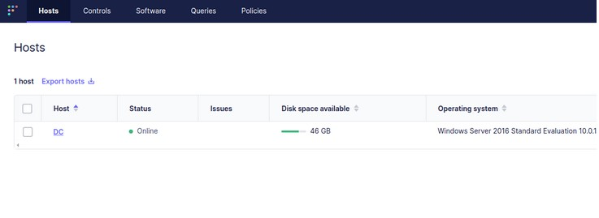
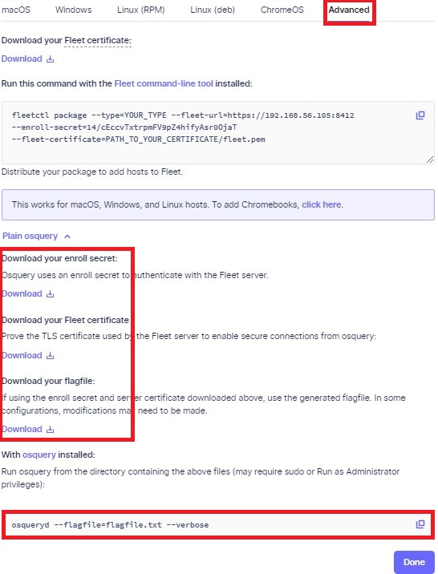

# LB2 - Beschreibung der Software OSQuery (10%)

## 1.1 Lernziele OSQuery#

Jede/r Lernende:

    ...kann in eigenen Worten die Applikation OSQuery beschreiben
    ...kann OSQuery nach Vorgaben konfigurieren
    ...kann OSQuery anwenden (erste Tests durchführen)

## 1.2 Registierung der Clients anstossen OSQuery#

Damit Sie mittels Osquery die Daten der Windows-VMs auslesen können, müssen die Geräte bei der Software Fleet registriert werden. Dies "sollte" eigentlich im normalen Bootup-Prozess der VMs geschehen sein...das ist allerdings kompliziert und aufgrund von verschiedenen Zertifikaten erfahrungsgemäss ziemlich fehleranfällig.

Idealerweise sollten Sie nach dem Login auf http://192.168.56.105:8412 eigentlich die folgende View sehen:

Kein Host ersichtlich?

Sollten Sie keinen Host sehen, hat die Registierung nicht funktioniert und Sie müssen die folgenden Schritte durchführen.

### 1.2.1 Nochmals initialisieren OSQuery#

- Stoppen Sie den osquery-Dienst auf Ihrer Windows-VM
- Öffnen Sie in der Windows VM die Webseite von Fleet https://192.168.56.105:8412/ und klicken Sie auf Add host
- Laden Sie das flagfile.txt, enroll secret und Fleet certificate 
- Ersetzen Sie im flagfile.txt den Host 192.168.56.105 mit dem Hostnamen fleet 

- Führen Sie nun den Registrierungsbefehl nochmals aus: osqueryd --flagfile=flagfile.txt --verbose

- Führen Sie jetzt diese Schritte auf beiden VMs durch - Achtung: Dieser Osqueryd-Befehl muss in einer Konsole laufen, damit Sie mit Osquery arbeiten können

## 1.3 Aufträge und Bewertungskriterien OSQuery#

**Recherche - OSQuery 0-4P: **

- Was ist OSQuery? Wofür wird es verwendet [OSQuery](tech_daten/osQuery_P4.md)
- Was ist die aktuellste Version von OSQuery? [OSQuery](tech_daten/osQuery_P4.md)
- Was sind Beispiel-Anwendungen/Use-Cases bei welchen OSQuery helfen kann? [OSQuery](tech_daten/osQuery_P4.md)

Wichtig

Auf Ihrem System wurde OSQuery bereits installiert und konfiguriert (Best-Practices) - Tipp: Betrachten Sie das Script "scripts/install-osquery.ps1"

**Konfiguration / Testing - OSQuery 0-4P: **

- Dokumentieren Sie das Config-File welches auf Ihrem System für OSQuery installiert ist [OSQuery Config-File](tech_daten/osQueryConfig_P4.md)
- Dokumentieren Sie die Struktur des Config-Files [OSQuery Config-File](tech_daten/osQueryConfig_P4.md)
- Führen Sie einen ersten Test mittels OSquery durch und dokumentieren Sie das Resultat [OSQuery Testen](tech_daten/osQueryTesten.md)

