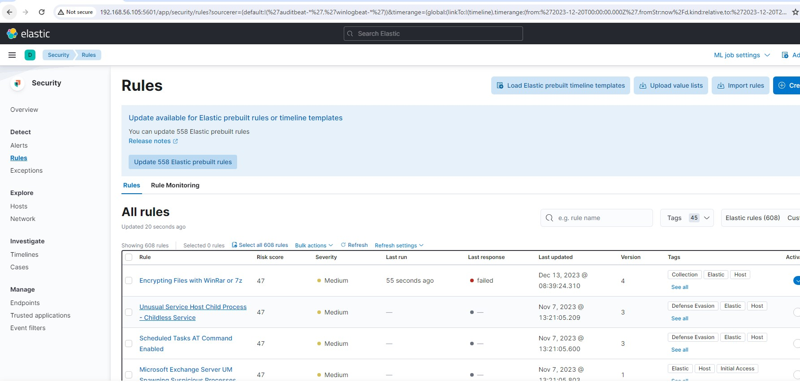

# LB2 - Security Dashboards ELK (15%)
## 1.1 Lernziele#

Jede/r Lernende:

    ...kann in eigenen Worten beschreiben wie Security Alerts in ELK aufgebaut werden

## 1.2 Info

Unter dem [Link](192.168.56.105:5601/app/security/rules) (geht nur innerhalb der VM umgebung!) sind verschiedene Security Rules vordefiniert. In unserer Open Source-Lizenz ist jeweils nur !eine! Rule gleichzeitig aktivierbar.

## 1.3 Aufträge und Bewertungskriterien#

### 1.3.1 Recherche - Security Dashboards/Rules 0-4P:

- Beschreiben Sie wie die Security Rules allgemein aufgebaut sind (mit Printscreens) [Security Rules](tech_daten/securityELK_P5.md)

### 1.3.2 Testing und Doku 0-8P:

- Suchen Sie sich ein Beispiel aus der Liste aus und dokumentieren Sie das Beispiel konkret (mit Printscreens) [Security Beispiel]()
- Versuchen (und dokumentieren Sie den Versuch!) einen Alert für Ihre Rule zu generieren (mit Printscreens)
