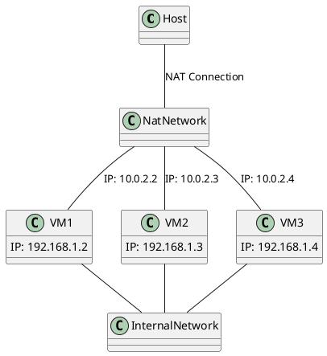

# Netzwerk Diagramm

```plantuml
@startuml
class Host {
}

class VM1 {
  IP: 192.168.1.2
}

class VM2 {
  IP: 192.168.1.3
}

class VM3 {
  IP: 192.168.1.4
}

class InternalNetwork {
}

class NatNetwork {
}

Host -- NatNetwork : NAT Connection
NatNetwork -- VM1 : IP: 10.0.2.2
NatNetwork -- VM2 : IP: 10.0.2.3
NatNetwork -- VM3 : IP: 10.0.2.4

VM1 -- InternalNetwork
VM2 -- InternalNetwork
VM3 -- InternalNetwork

@enduml
```