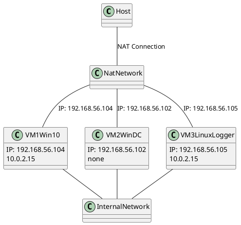

# Netzwerk Diagramm

```plantuml
@startuml
class Host {
}

class VM1Win10 {
  IP: 192.168.56.104
      10.0.2.15
}

class VM2WinDC {
  IP: 192.168.56.102
      none
}

class VM3LinuxLogger {
  IP: 192.168.56.105
      10.0.2.15
}

class InternalNetwork {
}

class NatNetwork {
}

Host -- NatNetwork : NAT Connection
NatNetwork -- VM1Win10 : IP: 192.168.56.104
NatNetwork -- VM2WinDC : IP: 192.168.56.102
NatNetwork -- VM3LinuxLogger : IP: 192.168.56.105

VM1Win10 -- InternalNetwork
VM2WinDC -- InternalNetwork
VM3LinuxLogger -- InternalNetwork

@enduml
```