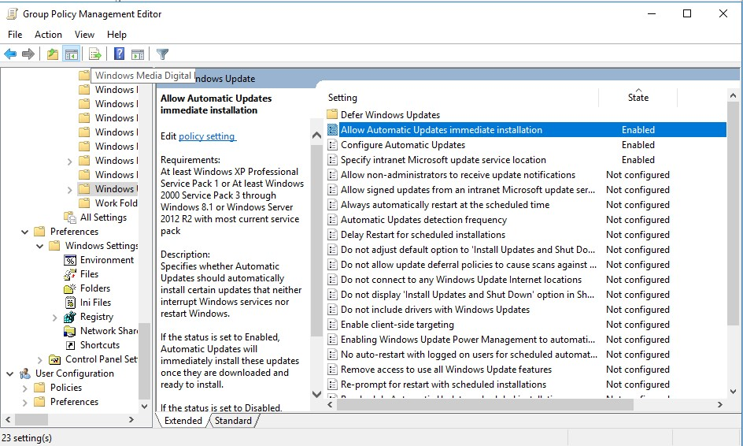

# Update-Prozess mittels GPOs

Die Konfiguration von Windows Update über Gruppenrichtlinien (Group Policy Objects - GPOs) ermöglicht es, den Update-Prozess auf Client-Computern über den WSUS-Server zu steuern.

## Erstellen einer Gruppenrichtlinie für WSUS:

   Öffnen Sie die Gruppenrichtlinienverwaltung auf Ihrem Domain Controller oder auf einem Computer mit den erforderlichen Tools installiert.

   Erstellen Sie eine neue Gruppenrichtlinie oder bearbeiten Sie eine vorhandene Gruppenrichtlinie, die auf die gewünschten Computer angewendet wird.

## Konfigurieren der WSUS-Einstellungen:

   Navigieren zu: "Computerkonfiguration" > "Richtlinien" > "Administrative Vorlagen" > "Windows-Komponenten" > "Windows Update".

   Konfigurieren der folgenden Einstellungen:
   "Automatische Updates konfigurieren" auf "Aktiviert" setzen.
   "Benutzer zur Installation von Updates auffordern" auf "Automatisch herunterladen und geplante Installation" setzen.
   "WSUS-Server angeben" auf "Aktiviert" setzen und den Servernamen und den Port des WSUS-Servers angeben (z.B., http://WSUSServerName:8530).

## Konfigurieren der Update-Planung:

   Unter "Computerkonfiguration" > "Windows-Einstellungen" > "Administrative Vorlagen" > "Windows-Komponenten" > "Windows Update" können Sie auch die Update-Planung konfigurieren.

   Zum Beispiel können Sie "Automatische Updates konfigurieren" und "Installationszeitpunkt für automatische Updates festlegen" verwenden, um festzulegen, wann die Updates installiert werden sollen.

## Aktivieren der Gruppenrichtlinie:

   Sobald die Einstellungen konfiguriert sind, aktivieren Sie die Gruppenrichtlinie, indem Sie sie auf die entsprechenden OUs, Computer oder Benutzer anwenden.

## Überprüfen der Client-Einstellungen:

   Auf einem Client-Computer können Sie die WSUS-Einstellungen überprüfen, indem Sie in der Eingabeaufforderung oder PowerShell das Cmdlet ausführen:

   powershell

   Get-ItemProperty -Path "HKLM:\SOFTWARE\Policies\Microsoft\Windows\WindowsUpdate"

## Erzwingen von Gruppenrichtlinienaktualisierungen:

   Führen Sie auf den Client-Computern gpupdate /force aus oder warten Sie auf die automatische Aktualisierung der Gruppenrichtlinien.

Nachdem diese Schritte durchgeführt wurden, sollten die betroffenen Computer ihre Updates vom WSUS-Server gemäss den konfigurierten Richtlinien empfangen. Stellen Sie sicher, dass die Firewall-Einstellungen auf den Clients und dem WSUS-Server entsprechend konfiguriert sind, um die Kommunikation zu ermöglichen.

## Zusatznotiz

Ich habe leider keinen Computer unter dem WSUS-Dienst, obwohl sich der Client in der Domäne befindet. Auch nach dem Entfernen des Clients und erneutem Einbinden hatte ich keinen Erfolg.

>[!NOTE]
> Mit Herrn Inauen besprochen nicht weiter zu verfolgen, falls nach erneutem Hinzufügen in die Domäne immer noch nicht im WSUS-Dienst auffindbar.