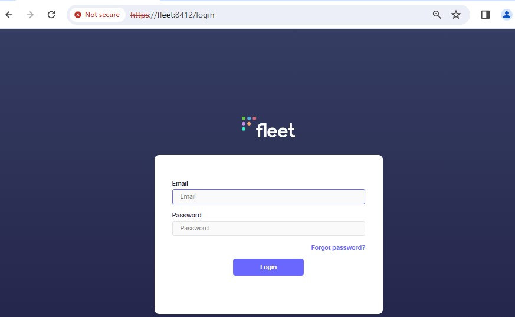
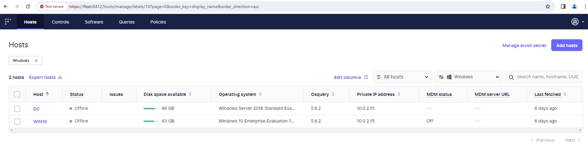
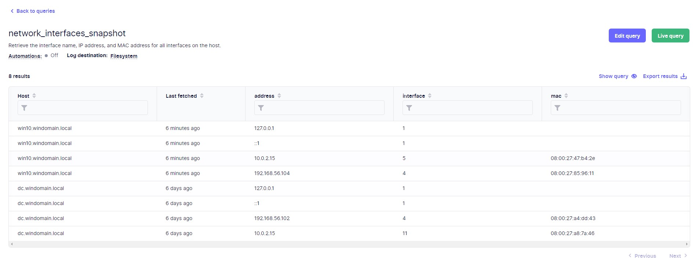
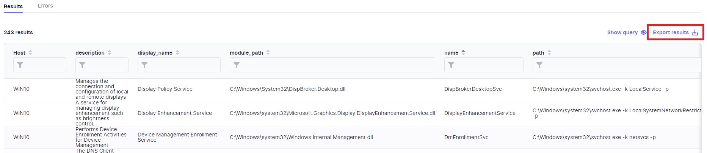
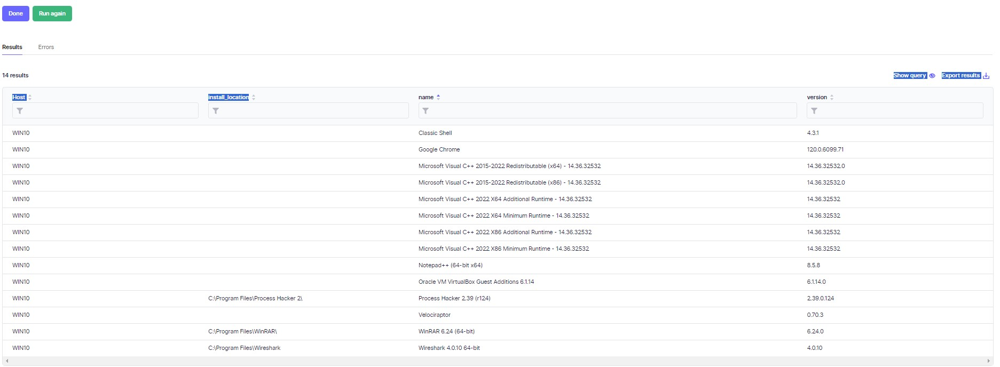

# OSQuery Testen


## OSQuery starten

Mit Powershell sich ins Verzeichniss mit dem gespeichertem Flag-File begeben und folgenden Befehl ausführen

````bash
osqueryd --flagfile=flagfile.txt --verbose
````

## Seite öffnen




Unter **Hosts** weiteren Rechner hinzufügen



## Querys

Abfrage aller Schnittstellen den abgefragten Rechner



Code:

````sql
SELECT a.interface, a.address, d.mac 
FROM interface_addresses a 
JOIN interface_details d 
USING (interface);
````

Schöne Abfrage aller Dienste

Man kann sich den Report auch einfach herunterladen als CSV und schnell irgendwo anders einbinden.



Code:

````sql
SELECT * FROM services 
         WHERE start_type='DEMAND_START' OR start_type='AUTO_START';
````

Ein Teil der Auflistung der CSV-Datei

| host_display_name                           | description                                                                                                           | display_name                                  | module_path                                   | name                                           | path                                                             | pid  | service_exit_code | service_type    | start_type    | status   | user_account                        | win32_exit_code |
| ------------------------------------------- | --------------------------------------------------------------------------------------------------------------------- | --------------------------------------------- | --------------------------------------------- | ---------------------------------------------- | ----------------------------------------------------------------- | ---- | ----------------- | --------------- | ------------- | -------- | ----------------------------------- | --------------- |
| WIN10                                       | Routes AllJoyn messages for the local AllJoyn clients. If this service is stopped, the AllJoyn clients that do not have their own bundled routers will be unable to run. | AllJoyn Router Service                       | C:\Windows\System32\AJRouter.dll             | AJRouter                                        | C:\Windows\system32\svchost.exe -k LocalServiceNetworkRestricted -p | 0    | 0                 | SHARE_PROCESS    | DEMAND_START   | STOPPED  | NT AUTHORITY\LocalService           | 1077            |
| WIN10                                       | Provides support for 3rd party protocol plug-ins for Internet Connection Sharing                                  | Application Layer Gateway Service            |                                               | ALG                                            | C:\Windows\System32\alg.exe                                     | 0    | 0                 | OWN_PROCESS      | DEMAND_START   | STOPPED  | NT AUTHORITY\LocalService           | 1077            |
| WIN10                                       | Runtime for activating conversational agent applications                                                             | Agent Activation Runtime_7e4c9               |                                               | AarSvc_7e4c9                                   | C:\Windows\system32\svchost.exe -k AarSvcGroup -p                 | 0    | 0                 | UNKNOWN          | DEMAND_START   | STOPPED  |                                   | 1077            |
| WIN10                                       | Determines and verifies the identity of an application. Disabling this service will prevent AppLocker from being enforced. | Application Identity                         | C:\Windows\System32\appidsvc.dll            | AppIDSvc                                       | C:\Windows\system32\svchost.exe -k LocalServiceNetworkRestricted -p | 0    | 0                 | SHARE_PROCESS    | DEMAND_START   | STOPPED  | NT Authority\LocalService            | 1077            |
| WIN10                                       | Processes installation, removal, and enumeration requests for software deployed through Group Policy. If the service is disabled, users will be unable to install, remove, or enumerate software deployed through Group Policy. If this service is disabled, any services that explicitly depend on it will fail to start. | Application Management                       | C:\Windows\System32\appmgmts.dll            | AppMgmt                                        | C:\Windows\system32\svchost.exe -k netsvcs -p                     | 0    | 0                 | SHARE_PROCESS    | DEMAND_START   | STOPPED  | LocalSystem                        | 1077            |
| WIN10                                       | Gets apps ready for use the first time a user signs in to this PC and when adding new apps.                         | App Readiness                                |                                               | AppReadiness                                   | C:\Windows\System32\svchost.exe -k AppReadiness -p                 | 0    | 0                 | SHARE_PROCESS    | DEMAND_START   | STOPPED  | LocalSystem                        | 1077            |
| WIN10                                       | Provides infrastructure support for deploying Store applications. This service is started on demand and if disabled Store applications will not be deployed to the system, and may not function properly. | AppX Deployment Service (AppXSVC)            | C:\Windows\system32\appxdeploymentserver.dll | AppXSvc                                        | C:\Windows\system32\svchost.exe -k wsappx -p                     | 0    | 0                 | SHARE_PROCESS    | DEMAND_START   | STOPPED  | LocalSystem                        | 0               |
| WIN10                                       | Facilitates the running of interactive applications with additional administrative privileges. If this service is stopped, users will be unable to launch applications with the additional administrative privileges they may require to perform desired user tasks. | Application Information                       | C:\Windows\System32\appinfo.dll             | Appinfo                                        | C:\Windows\system32\svchost.exe -k netsvcs -p                     | 0    | 0                 | SHARE_PROCESS    | DEMAND_START   | STOPPED  | LocalSystem                        | 1077            |
| WIN10                                       | AssignedAccessManager Service supports kiosk experience in Windows.                                                 | AssignedAccessManager Service                 | C:\Windows\System32\assignedaccessmanagersvc.dll | AssignedAccessManagerSvc                       | C:\Windows\system32\svchost.exe -k AssignedAccessManagerSvc      | 0    | 0                 | SHARE_PROCESS    | DEMAND_START   | STOPPED  | LocalSystem                        | 1077            |
| WIN10                                       | Manages audio devices for the Windows Audio service. If this service is stopped, audio devices and effects will not function properly. If this service is disabled, any services that explicitly depend on it will fail to start | Windows Audio Endpoint Builder               | C:\Windows\System32\AudioEndpointBuilder.dll | AudioEndpointBuilder                            | C:\Windows\System32\svchost.exe -k LocalSystemNetworkRestricted -p | 1136 | 0                 | SHARE_PROCESS    | AUTO_START      | RUNNING  | LocalSystem                        | 0               |
| WIN10                                       | Manages audio for Windows-based programs. If this service is stopped, audio devices and effects will not function properly. If this service is disabled, any services that explicitly depend on it will fail to start | Windows Audio                               | C:\Windows\System32\Audiosrv.dll             | Audiosrv                                       | C:\Windows\System32\svchost.exe -k LocalServiceNetworkRestricted -p | 1992 |

Ausgabe installierter Programme



Code:

````sql
SELECT name, version, install_location
FROM programs
WHERE uninstall_string IS NOT NULL AND install_location IS NOT NULL
````