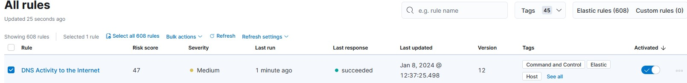
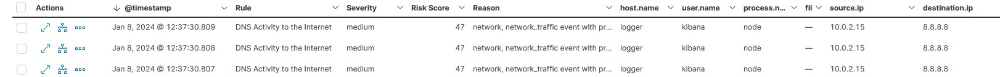
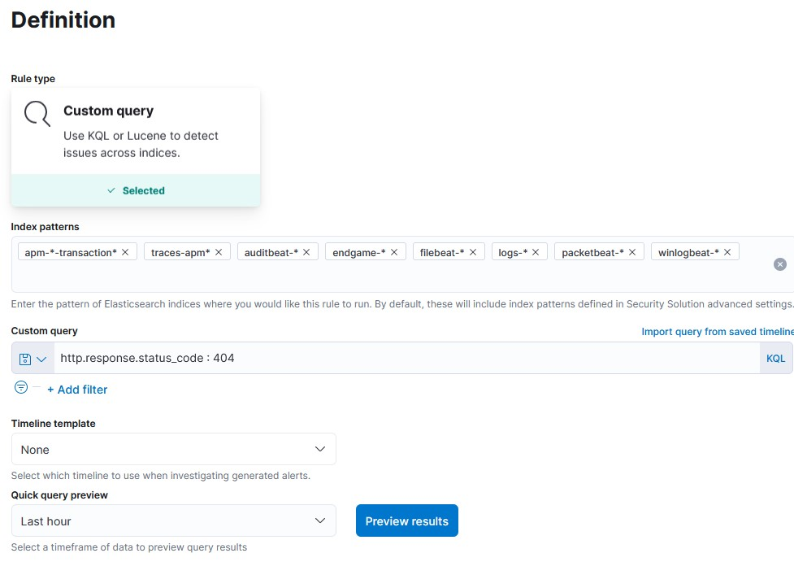
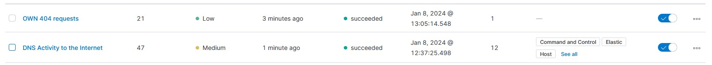
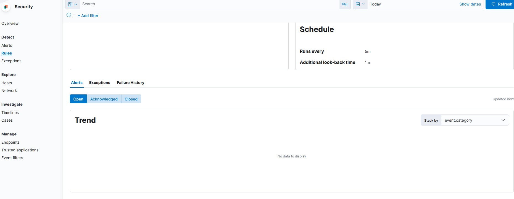

# Security ELK Beispiel

## Bestehende Regel

Für das erste Beispiel wurde die bestehende Regel ```DNS Activity to the Internet``` verwendet.

**Beschreibung**  
Diese Regel erkennt, wenn ein interner Netzwerk-Client DNS-Datenverkehr direkt an das Internet sendet. Dies ist ein untypisches Verhalten für ein verwaltetes Netzwerk und kann auf Malware, Exfiltration, Command and Control oder einfach eine Fehlkonfiguration hindeuten. Diese DNS-Aktivität beeinträchtigt auch die Fähigkeit Ihres Unternehmens, eine unternehmensweite Überwachung und Protokollierung von DNS bereitzustellen, und öffnet Ihr Netzwerk für eine Vielzahl von Missbräuchen und böswilliger Kommunikation.

### Durchführung

Die Regel wird auf der rechten Seite aktiviert. In dieser Version ist es nicht möglich, zwischen allen Regeln zu wählen. Es kann immer nur eine Regel aktiv sein.



Bei der Ausgabe fällt auf, dass kibana selbst vom Log-Server aus immer wieder DNS-Kommunikationen durchführt. Diese sind eher untypisch und sollten in einer produktiven Umgebung genauer betrachtet werden. Ob dieser Traffic nicht zu Komplikationen führen kann oder bereits eine potentielle Bedrohung darstellt.



## Eigene Regel

Für dieses Beispiel wurde versucht eine Regel zu erstellen mit dem Namen ``OWN 404 Requests``.

**Beschreibung**
Diese Regel soll Aufrufe von Seiten protokollieren, welche nicht gefunden wurden und daher ein **404** Status-Code zurückgeben.

## Durchführung

Erstellung eines Custom Query mit der Verwendung von **KQL** und dem Befehl ```http.response.status_code : 404```. Dadurch wird nur reagiert, falls der Status-Code ein **404** ist.



Interessanterweise konnte die vordefinierte Regel gleichzeitig mit der eigenen Regeln aktiv sein.



Der Versuch ist fehlgeschlagen. Trotz mehreren aufrufen vom WS DC auf mehrere Seiten, die mit **404 Status-Code** geantwortet haben wurden diese nicht protokolliert und ich habe kein Ergebniss.

