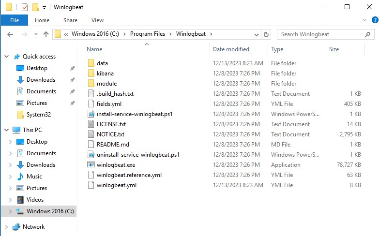
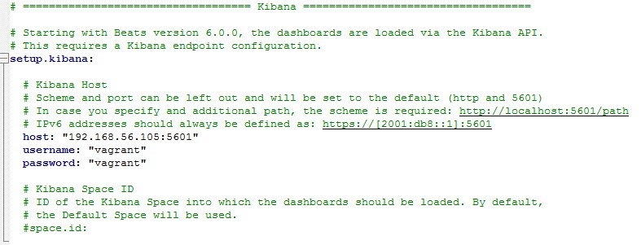
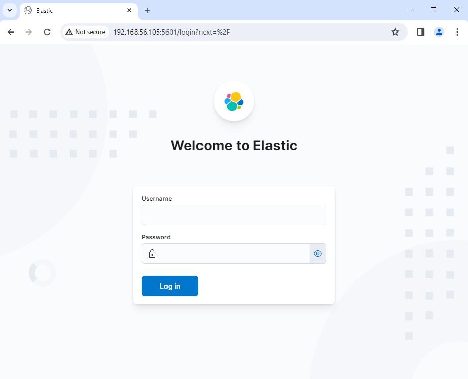
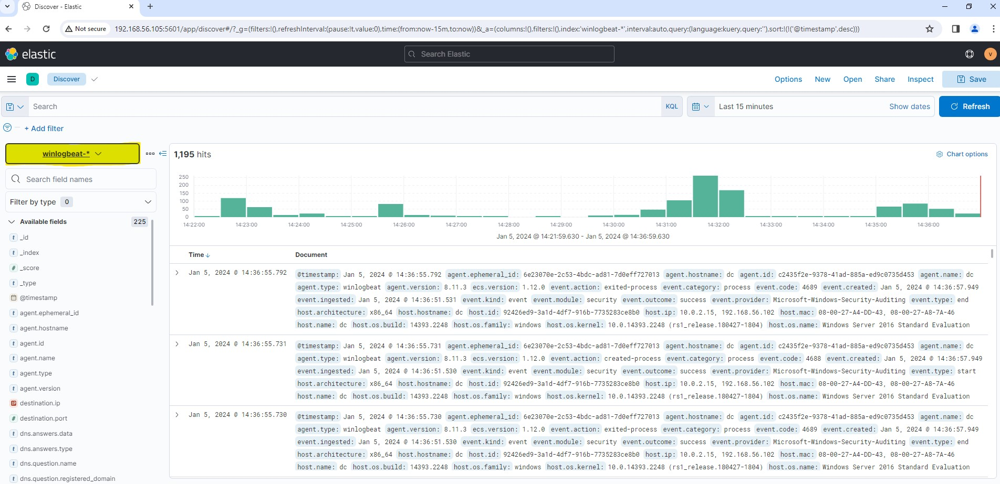

# Winlogbeat Installation & Konfiguration

Die Prozedur dient zur Installation und Konfiguration von Winlogbeat.

## Herunterladen & entpacken

Um Winlogbeat zu verwenden, müssen Sie zuerst das Zip-File von Winlogbeat herunterladen und installieren.

-  Nachdem das Zip-File heruntergeladen wurde, entpacken wir es. 
-  Nun verschieben wir den gesamten Inhalt in das Verzeichnis C:\Program Files\Winlogbeat.



## Konfiguration anpassen

Innerhalb des winlogbeat.yml file müssen im Bereich von Kibana **host**, **username** und **passwort** angepasst weden an unsere Umgebung.



## Installation

Nun können wir mittels Powershell in das Verzeichnis bewegen um folgenden Befehl auszuführen.

````bash
.\install-serivce-winlogbeat.ps1
````

Legendlich initialisieren wir Installation-Skript, welches da bereitgelegt ist.

## Ergebniss

Wurde alles dementsprechend installiert, können wir nun über den Browser **http://192.168.56.105:5601/** Elastic aufrufen 



Nach dem Einloggen mit den Angaben, welche im Config-file hinterlegt wurden, kann man nun auf der Linken Seite auf winlogbeat wechseln um schonmal eine Übersicht zu erhalten.

